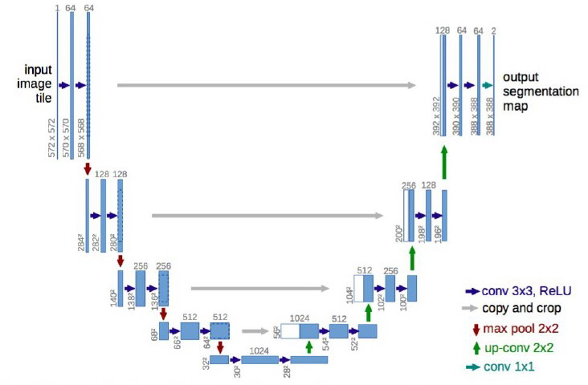

## Models

In this folder of the repository, we can find the two different models that we have implemented so as to perform our image segmentation task. A more detailed explanation of the scripts themselves can be found below but both are based on the __U-Net__ architecture.

The U-Net, which was first introduced in the paper _U-Net: Convolutional Networks for Biomedical Image Segmentation_ ([see it here](https://arxiv.org/pdf/1505.04597.pdf)), is mainly splitted into three parts: _downsampling path_, _bottleneck_ and _upsampling path_. The former consists on performing a sequence of convolutions iterspersed with max pooling operations whereas the latter carries out convolutions as well but interspersed with deconvolutions. Moreover, the feature maps obtained in the downsampling are concatenated with the ones obtained in the upsampling by means of the so called _skip connections_ so as to recover the information regarding the characteristic's localization.

The picture below depicts the U-Net architecture presented on the already mentioned paper.

### unet_tensorflow.py

In this script we can find an implementation of the U-Net but constructed from sratch by us using tensorflow. When developing the model, we followed quite faithfully the architecture given in the original paper. That is, we keep the same number of layers, perform the same operations (same convolutions, skip connections and activation functions) and use the parameters' inicialization given there. However, we also introduce little changes: we use zero padding so as to preserve the size of the feature maps, we add the option of performing batch normalization before the activation function and we also add an optional dropout layer after the bottleneck.

### unet_keras.py

In this script we can find another implementation of the U-Net using keras. This model was taken from the github repository <https://github.com/zhixuhao/unet/blob/master/model.py>. However, since our segmentation task consists in classifying each pixel as belonging to one of four possible classes, we have adapted the last convolutional layer so as to obtain an output with four channels. \
This model also follows the original paper with the only difference that it adds some dropout layers along the network and performs zero padding.

__Both networks return a tuple__, where the first element is the output of the last layer undergoing a linear activation whereas the second one undergoes a softmax activation. The reason of returning two different values is the fact that, when computing the loss in the train.py script (_tf.losses.softmax_cross_entropy_), no softmax have to be applied to the logits of the network since the loss itself is responsible of applying it. On the other hand, the implementation of the metrics IoU (_tf.metrics.mean_iou_) requires the logits to be non-negative, which can be achieved by means of a softmax.\
Moreover, both models have the parameter _binarize_labels_ to tell whether the outputs should have two (in case of setting the parameter to _True_) or four channels (in case of setting it to _False_). In the former we only differentiate between background and tumour whereas in the former we differenciate between background and three different parts of the tumour tissue.
